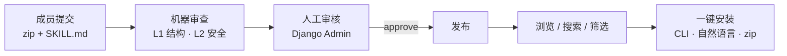

# skills-hub


> 把团队里散落在每个人电脑上的 Claude Code skill，沉淀成「提交 → 审核 → 发布 → 一键安装」的共享资产库。

**skills-hub** 是一个自托管的企业私有 AI 工具仓库：为团队提供一套结构化的方式来收集、审核与分发面向 Claude Code 等 AI 工具的 **skills / subagents**，让新成员"按岗位下载、开箱即用"，快速具备岗位所需的 AI 工作能力。

## 为什么用它

- **散落 → 沉淀**：个人 skill 散在各自机器上，离职即丢失；这里集中保管 + 多版本留存。
- **可控分发**：机器审查（结构 + 安全）+ 人工审核把关，避免未经审视的 skill 在团队里扩散。
- **零门槛安装**：成员复制一行命令、或把自然语言粘给 AI，即可装到本地。
- **自托管 + 可插拔**：一台装了 Docker 的机器就能跑；MySQL / Redis / 文件存储都能在「内置」与「外部实例」间切换，从 POC 平滑长到生产。

适合：有多名 Claude Code 使用者、希望统一沉淀与分发 AI 工具的工程 / 数据 / 运营团队。

## 工作流



## 核心能力

- **提交**：上传 skill（zip，含 `SKILL.md` + 说明文档），支持多版本保留
- **审核**：机器审查（L1 结构校验 + L2 安全扫描，纯规则、无 LLM）→ 人工审核队列（Django Admin）+ 审计日志
- **浏览 / 搜索**：catalog 列表、关键字搜索、标签筛选、详情页
- **安装**：三种方式（CLI 脚本 / 向 AI 粘贴自然语言 / 手动下载 zip）× 三平台（Linux / macOS / Windows）
- **多工具目标**：配置驱动（`config/tools.yaml`），开箱支持 Claude Code、WorkBuddy，可自行扩展
- **认证**：企业邮箱白名单 + OTP 登录（无密码、无注册），member / admin 两档角色
- **可插拔基础设施**：MySQL / Redis 均可在「内置容器」与「外部实例」间切换；文件存储支持本地盘或阿里云 OSS
- **通知**：SMTP 邮件（OTP、审核结果）

技术栈：Django 5 · MySQL 8 · Celery + Redis · Tailwind CSS v4 + DaisyUI · Docker Compose。

## 快速开始（POC / 全内置，只需 Docker）

前置：**Docker 24+ 与 Docker Compose v2.20+**，此外无需安装 Node / Python —— 前端产物在镜像构建阶段已编译进镜像。

```bash
git clone <repo> skills-hub
cd skills-hub
cp deploy/.env.example deploy/.env        # 全内置默认值即可跑通，按需改密钥/域名
docker compose -f deploy/docker-compose.yml \
  --profile bundled-mysql --profile bundled-redis up -d --build
curl localhost:8000/healthz               # → {"status":"ok","checks":{"db":"ok","redis":"ok"}}
```

首次启动 mysql 要初始化数据库（约 20s），web 会等它就绪；`docker compose ps` 全部 `healthy` 即可访问 `http://localhost:8000`。

> **登录需要 SMTP**：OTP 验证码通过邮件下发，配好 `SMTP_*` 才能登录。创建管理员、登录、提交→审核→发布→安装的完整验证流程见 [`docs/deploy.md`](docs/deploy.md)。
>
> 本地开发用 `make up`（叠加源码挂载即时生效 + 自动编译 Tailwind，需本机 npm）；`make help` 查看全部命令。

## 部署形态：内置 / 外部中间件自由组合

MySQL 和 Redis 各自独立，都可在「内置容器」与「外部实例」之间切换：

| 中间件 | 用内置 | 用外部 |
|---|---|---|
| MySQL | 加 `--profile bundled-mysql` | `.env` 设 `DB_HOST` 等指向外部 RDS（不加该 profile） |
| Redis | 加 `--profile bundled-redis` | `.env` 设 `REDIS_URL` / `CELERY_*` 指向外部 Redis（不加该 profile） |

按 `deploy/.env.example` 各区块的「形态 A 外部 / 形态 B 内置」注释切换连接串即可。生产推荐 MySQL 用外部 RDS（数据有备份 / HA）；Redis 仅作 Celery 传输、不存持久数据，内置容器几乎零运维。

完整生产部署（`.env` 详解、healthcheck、上线 checklist、反向代理 / HTTPS、升级）见 [`docs/deploy.md`](docs/deploy.md)。

## 测试

```bash
make test     # host 上跑 pytest（TEST_USE_SQLITE 模式：内存 SQLite + 内存 Celery broker）
```

单元测试不依赖 MySQL / Redis 容器（仅 `/healthz` 探活需要一个 redis 容器，`make test` 会自动起）。本机需安装 [uv](https://docs.astral.sh/uv/)。

## License

[Apache-2.0](LICENSE) © 2026 Tango
